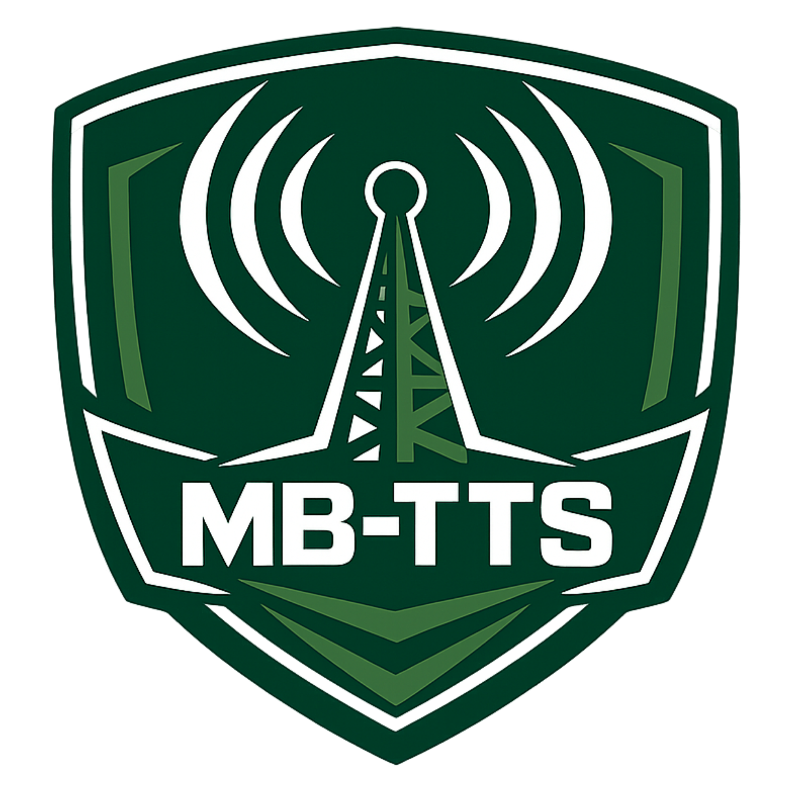

<div align="center">
  

  <h1>MB-TTS System</h1>
  <p><strong>Hệ thống Phát thanh Trí tuệ Nhân tạo Nội bộ (Offline TTS)</strong></p>

  <p>
    
    
    
    
  </p>
</div>

---

## 📖 Giới thiệu

## MB-TTS (Military Broadcast Text-to-Speech)

- là một phần mềm Desktop chuyên dụng được thiết kế cho các cơ quan, đơn vị cần sản xuất nội dung âm thanh/phát thanh với yêu cầu

## BẢO MẬT TUYỆT ĐỐI.

- Hệ thống hoạt động **100% Offline (Air-gapped)** không cần kết nối Internet, sử dụng lõi AI Piper và FFmpeg để biến văn bản thành giọng nói tự nhiên, kết hợp nhạc nền chuyên nghiệp ngang tầm các nền tảng Studio trực tuyến.

## ✨ Tính năng Nổi bật

- 🛡️ **Bảo mật tối đa (100% Offline):** Mọi quá trình xử lý AI và xuất file đều diễn ra trên máy tính cục bộ. Không có dữ liệu nào được gửi ra ngoài.
- 🎙️ **Trình soạn thảo Đa giọng đọc:** Hỗ trợ chia đoạn văn bản (Blocks), cho phép thiết lập Giọng Nam, Giọng Nữ đan xen trong cùng một bản tin.
- 🎛️ **Bộ trộn Âm thanh (Audio Mixer):** Tự động lồng ghép giọng đọc với Nhạc nền/Hành khúc. Điều chỉnh âm lượng độc lập và xuất ra file MP3/WAV hoàn chỉnh.
- 📚 **Từ điển Thuật ngữ (Lexicon):** Tự động chuẩn hóa các từ viết tắt chuyên ngành quân sự/nhà nước (VD: "BQP" ➔ "Bộ Quốc phòng") giúp AI đọc chuẩn xác.
- 💾 **Quản lý Kịch bản:** Lưu nháp các dự án đang thực hiện, dễ dàng chỉnh sửa và tái sử dụng.
- 📥 **Nạp Model linh hoạt:** Quản lý kho giọng đọc nội bộ, cho phép import thêm các model giọng nói (`.onnx`) từ USB.
- 🧪 **Phòng Thí nghiệm AI (Standby):** Giao diện sẵn sàng cho việc tích hợp module Huấn luyện giọng nói (Voice Cloning) khi có phần cứng GPU phù hợp.

---

## 📸 Giao diện Ứng dụng

- > **Lưu ý:** Thêm ảnh chụp màn hình phần mềm của bạn vào thư mục `docs/images/` và cập nhật lại đường dẫn bên dưới.

<details>
<summary><b>1. Không gian Phòng thu (Studio)</b></summary>
<br>

</details>

<details>
<summary><b>2. Bộ trộn Nhạc nền & Đa giọng đọc</b></summary>
<br>

</details>

<details>
<summary><b>3. Quản lý Từ điển & Thuật ngữ</b></summary>
<br>

</details>

---

## 🛠️ Công nghệ Sử dụng

- **Frontend:** React.js, Tailwind CSS, Lucide Icons (Giao diện chuẩn Enterprise / Military).
- **Backend/Desktop:** Electron, Node.js.
- **Core AI:** [Piper TTS](https://github.com/rhasspy/piper) (Lõi Text-to-Speech tốc độ cao, tối ưu cho CPU).
- **Audio Processing:** `fluent-ffmpeg` & `ffmpeg-static` (Xử lý, nối và mix nhạc nền).

---

## 🚀 Hướng dẫn Cài đặt & Phát triển

### Yêu cầu hệ thống

- Hệ điều hành: Windows 10/11 (64-bit).
- Node.js (phiên bản 18.x trở lên).

### Chạy ở môi trường Phát triển (Development)

```bash
# 1. Clone repository
git clone [https://github.com/your-username/mb-tts-system.git](https://github.com/your-username/mb-tts-system.git)
cd mb-tts-system

# 2. Cài đặt các thư viện phụ thuộc
npm install

# 3. Chuẩn bị thư mục lõi AI
# Đảm bảo bạn đã có thư mục `extraResources` chứa piper.exe, ffmpeg và thư mục models, bgm.

# 4. Khởi chạy ứng dụng
npm run dev
```
